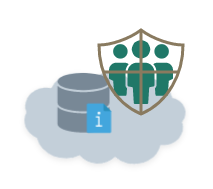

# DDS Soberano

> Ágil escalável sem equipe de equipes.

**Desenvolvimento Distribuído de Software (DDS) Soberano** é uma metodologia de desenvolvimento de software ágil de forma distribuída, e escalável, que tem o propósito de orientar a coordenação de pessoas em ambientes totalmente virtuais e dinâmicos. Apesar de tratar de desenvolvimento de software, seu foco são as questões de coordenação das pessoas em ambientes virtuais.

Esta metodologia é formada por Diretrizes, Papéis, Artefatos, Cerimônias e Atividades. Conta com um Fluxo de Trabalho para facilitar o entendimento da metodologia, apresentando a direção que segue as principais cerimônias e atividades.

[Visão Geral](README.md)
[Versão 1.0!](version_1.md)

